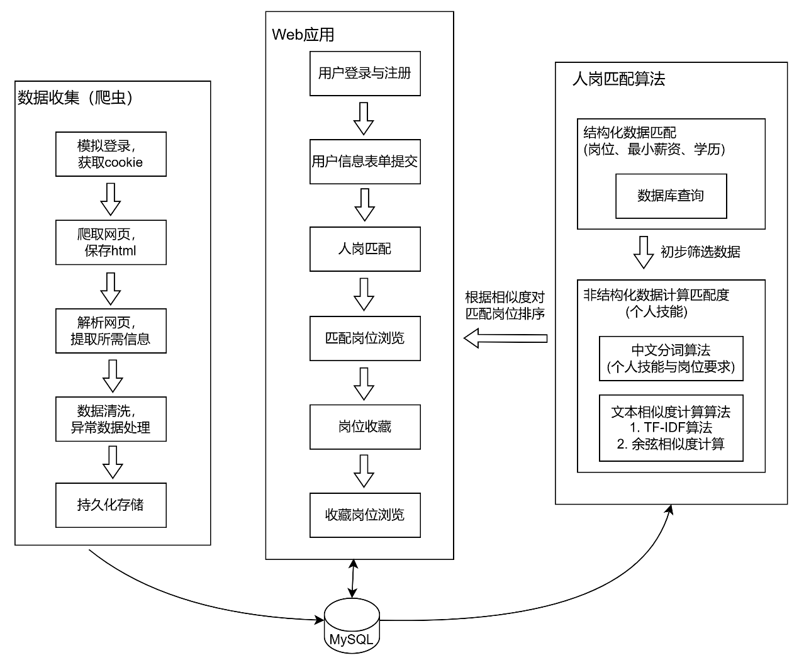
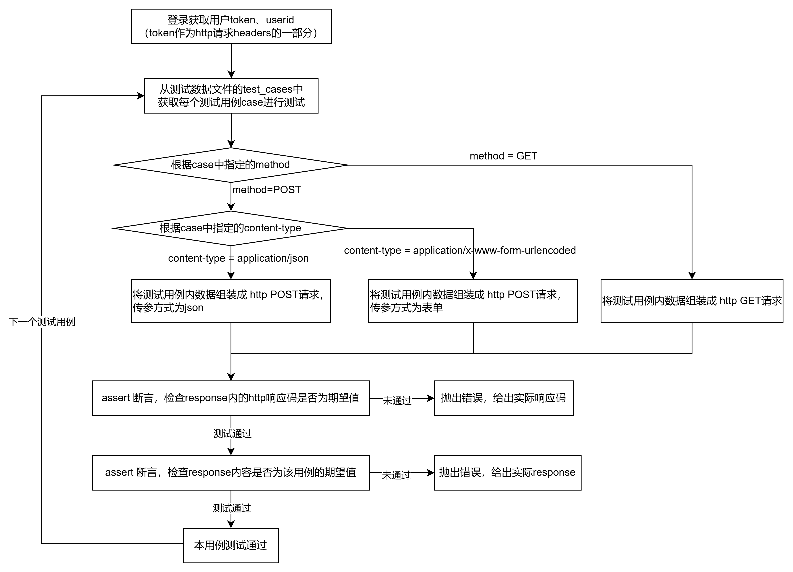
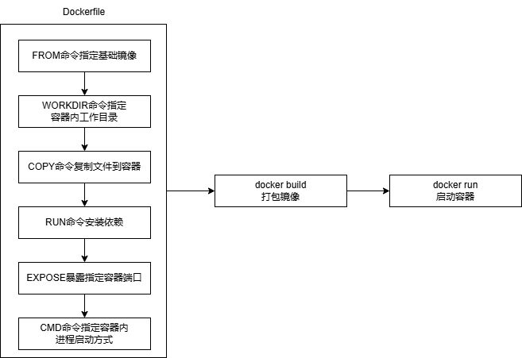
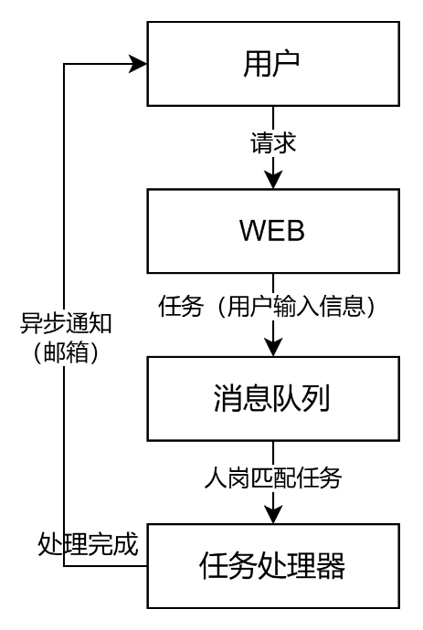

# 端到端智能人岗匹配系统
## 一、系统概览
### 1. 系统概述
本系统支持：
* 在网页端根据求职者的输入信息
* 智能计算求职者与在招岗位信息的匹配度并根据匹配程度排序展示岗位
* 支持求职者收藏岗位并浏览所有收藏岗位。
### 2. 网站设计
整体采用MVC分层模式：实现应用程序中业务逻辑、数据和界面显示分离
* 模型层（Model）：封装数据库操作，与数据库进行直接交互
* 视图层（View）：根据Controller传递来的数据，与静态文件（HTML/JS/CSS）组合
* 控制器（Controller）：解析接口入参、将入参转换为期望的返回数据、将返回数据传递给View组装为网页后返回给浏览器
### 3. 整体结构
* 数据库使用MySQL
* 网站使用Flask框架编写
* 系统部署在Docker上

## 二、API接口自动化测试设计
使用pytest框架进行接口自动化测试，将**测试数据参数化**，**测试流程与测试数据分离**
### 1. 测试流程

### 2. 测试数据参数化
```json
[
    {
        'url': 'http://127.0.0.1:5000/favoritejob/add',  // 需测试的接口路由
        'method': 'POST', // http 请求方法
        'content_type': 'application/json', // 请求body的负载格式
        'payload': {
            'userid': -1,
            'jobid': 88
        },
        'expected': { // 预期响应
            'status_code': 200,
            'response': {},
        }
    },
    {…},
    …
]
```
## 三、Docker部署
将MySQL与Web应用部署在Docker上，部署流程如下：  

## 四、目前问题与未来优化
### 1. 问题一：
* 岗位信息更新不及时。  
* 优化方案：为实现岗位数据的实时更新，可以考虑将爬虫部分也部署在docker上，并开启定时策略，定期从网站爬取数据，并将更新的数据处理后进行持久化存储。
### 2. 问题二：
* 人岗匹配接口响应较慢，用户需要在网页长时间等待，尤其是多人访问时。
* 优化方案：引入消息队列机制，实现用户发送匹配要求，可以关闭网页，后台匹配完成后再将数据返回给用户，思路如下：

